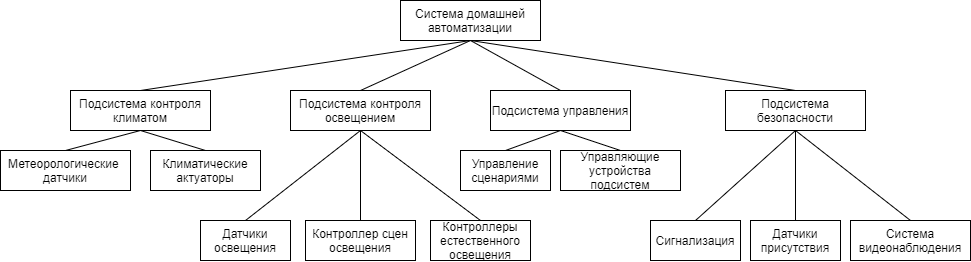

# ВВЕДЕНИЕ

В данной выпускной квалификационной работе описано создание межпротокольного шлюза
MQTT - CAN, в рамках программно-аппаратного комплекса умный дом.

Основная часть данной записки включает в себя следующие разделы.  

Раздел "Описание предметной области, анализ и выбор методов решения задач", описывающий основные принципы и понятия, используемые в домашней автоматизации, производится анализ существующих решений на рынке систем. Описываются проблемы существующих решений и предлагаются варианты решений этих проблем.

В разделе "Проектирование аппаратного обеспечения" описывается, процесс проектирования схемотехники и печатной платы межпротокольного шлюза MQTT-CAN, а так же обосновывается выбор тех или иных аппаратных компонентов.

В разделе "Проектирование программного обеспечения" описан процесс проектирования и спецификации сетевых и прикладных протоколов CAN шины, форматы кадров, алгоритмы их работы, а так же алгоритмы работы межпротокольного шлюза MQTT-CAN.

Раздел "Программная реализация" описывает структуру данных программного обеспечения межпротокольного шлюза, спецификации подпрограмм, блок-схемы алгоритмов работы подпрограмм и описание используемых в ПО, сторонних библиотек и зависимостей, руководство пользователя, и описание процесса тестирования готового ПАК.

@latex \clearpage @/latex

@todo РАМКИ

# ОПИСАНИЕ ПРЕДМЕТНОЙ ОБЛАСТИ, АНАЛИЗ И ВЫБОР МЕТОДОВ РЕШЕНИЯ ЗАДАЧ

## Описание и анализ предметной области

Программно-аппаратный комплекс - набор аппаратных и программных средств, работающих для выполнения одной или нескольких связанных задач.

Аппаратная часть комплекса представляет собой: компьютеры и микроконтроллеры объединенные в одну вычислительную сеть, посредством гетерогенных сетей, а так же различные датчики и исполнительные устройства.

Программной частью комплекса являются встроенное программное обеспечение, реализующее функционал исполнительных устройств и датчиков,  сетевое взаимодействие, различные программные модули сетевых протоколов.

Система домашней автоматизации решает ряд задач таких как:

* сбор и обработка данных полученных с датчиков системы, а так же с внешних источников.
* регулирование внутренних параметров системы, в зависимости от обработанных данных и предпочтений пользователей.
* обеспечение безопасности дома (пожарная безопасность, предупреждение аварийных ситуаций).
* упрощение однотипных процессов пользователей при помощи программируемых сценариев.
* экономия ресурсов домовладения, при помощи эффективного их использования.
* предоставление различных отчетов, по использованным ресурсам домовладения.

Саму система может включать в себя различные подсистемы разделенные по функциональным возможностям:

* подсистема управления освещением:
  * элементы управления освещением
  * модули управления естественным освещением (шторы, рольставни, электрохромные стекла)
  * датчики присутствия, освещения
  * контроллеры сцен освещения (RGB контроллеры)
* подсистема управления климатом:
  * внутренние и внешние метеорологические датчики (термометр, барометр, гигрометр, датчик уровня $CO_2$ и чистоты воздуха)
  * модули управления климатом
  * термостаты, рекуператоры, гигростаты, приточная и вытяжная вентиляция (с электрическим управлением)
* подсистема безопасности:
  * подсистема видеонаблюдения
  * модули детектирования утечек природного газа, утечек воды
  * умные замки
  * модули сигнализации и сирены
* управляющая подсистема

В данные момент на рынке систем домашних автоматизаций преобладают 2 типа реализаций: готовые экосистемы от крупных производителей и открытые реализации систем поддерживаемые и разрабатываемые сообществами энтузиастов.

Среди готовых продуктов зарубежных производителей можно отметить Xiaomi Smart Home, Philips Hue, Samsung SmartThings и другие. Отечественные компании так же предлагают к покупке экосистемные продукты такие как "Умный дом Sber" и "Умный дом (Rostelecom)".

Достоинства таких готовых систем заключаются в простоте настройки и расширения системы, гарантированной тех. поддержки от производителя. Зачастую инфраструктура таких систем находится в облачных вычислительных мощностях, что позволяет использовать домашние устройства из любой точки мира. Из этого следует один из основных недостатков готовых систем домашней автоматизации - привязка к инфраструктуре производителя. При отсутствии подключения к ней, устройства могут терять функционал, вплоть до полного отключения, в случае отсутствия автономных режимов работы. Так же у готовых систем есть проблемы с расширяемостью и совместимостью. Линейка устройств производимая одной компанией может не включать в себя необходимые пользователю устройства, и не иметь возможности расширить систему компонентами сторонних производителей. Использование ПО с закрытым исходным кодом или лицензиями, а так же отсутствие документации, затрудняет разработку компонентов для сторонних производителей или интеграцию компонентов таких систем в другие.

Открытые реализации систем домашней автоматизации, предлагают использование протоколов обмена информации, умных устройств, шлюзов лицензируемых по открытым лицензиям аппаратного и программного обеспечения (MIT, GPL, CERN OHL). Зачастую открытые реализации шлюзов протоколов поддерживают различные устройства из готовых экосистем описанных выше.

@todo написать про HA в разрезе подключения несовместимых между собой устройств 
Для 

@todo написать про селфхостед и облачные решения

@todo написать про то что современный умный дом это частный случай IOT, а старый очень похож на автоматизацию в промышленности.

## Выбор методов решения задачи

@todo (предлагаем гетерогенные приколы)

@todo (рассказываем про CAN)

@todo (рассказываем про MQTT)

@todo (рассказываем про Bluetooth LE Mesh)

@todo (рассказываем про все вместе)

@todo (схема концепции умного дома)

@latex \clearpage @/latex

# ПРОЕКТИРОВАНИЕ АППАРАТНОГО ОБЕСПЕЧЕНИЯ

## Разработка принципиальной схемы

@todo (нарисовать схему шлюза и рассказать про ее модули)

## Разработка печатной платы

@todo (нарисовать плату и рассказать про нее)

Печатная плата спроектирована для изготовления по следующим техничским процессам.

* Материал изготовления: стеклотекстолит FR4
* Минимальный зазор между проводниками: 0.1 мм
* Количество слоев: 2
* Переходные отверстия: 0.2 мм
* Минимальный размер отверстия: 0.2 мм
* Толщина печатной платы: 1.5 мм
* Толщина слоя металлизации: 18 мкм

@todo добавить ссылку на литературу на ГОСТ.
Класс точности печатной платы: 5 (ГОСТ 23751-86)

@latex \clearpage @/latex

# ПРОЕКТИРОВАНИЕ ПРОГРАММНОГО ОБЕСПЕЧЕНИЯ

## Разработка методов решения задач

@todo (схема модели OSI но с CAN)

Так как стандарт CAN не описывает протоколы прикладного и канального уровня, а существующие протоколы заточены на использования в автомобильной индустрии или крупных промышленных установок.

## Разработка структур данных

Ниже описаны структуры используемые в протоколе канального уровня CAN шины.

@todo CAN_ID, DHCP_CAN_IP: структуры данных

@todo Структуры данных, спецификации и блок схемы DHCP.

Следующие структуры используются в протоколе получения адреса DHCP_LIKE.

**Адресная таблица, используемая для управления адресами на CAN шине**

Для хранения информации о выданных адресах мастер на CAN шине (в данном случае шлюз), создает у себя в памяти таблицу соответствия адреса устройства на CAN шине и уникального аппаратного идентификатора.

Таблица представляет из себя массив размером до 255 элементов, каждый элемент содержит структуру запись таблицы.
Она состоит из 2 полей: 

* can_addr - 1 байтовое беззнаковое число, содержащее адрес устройства на шине.
* hwid - массив из 4-х 4 байтовых чисел, содержащее уникальный аппаратный идентификатор.

## Разработка и описание алгоритмов

**Алгоритмы работы с адресная таблицей**

@latex \clearpage @/latex

# ПРОГРАММНАЯ РЕАЛИЗАЦИЯ

## Описание модульной структуры программы

## Спецификации подпрограмм (методов)

**Функции модуля can_bus**

Функция `can_bus_init`

*Назначение*: Функция инициализации переферийного модуля CAN, так же в этой функции инициализируется адрес устройства на шине.

*Входные параметры*: нет

*Возвращаемое значения*: нет

Функция `can_send_packet`

*Назначение*: Функция передачи пакета по CAN шине. 

*Входные параметры*: 

* `uint8_t dest_addr` - Адрес назначения отправленного пакета
* `uint8_t frame_data` - Поле данных зависимых от типа пакета
* `uint8_t frame_type` - Тип пакета
* `uint8_t prior` - Приоритет пакета
* `uint8_t size` - Размер данных в основном теле пакета
* `uint8_t* data_ptr` - Указатель на данные.

*Возвращаемое значения*: нет.

Функция `can_recv_packet`

*Назначение*: Функция настраивает программные фильтры входящих пакетов, и ожидает окончания приема первого подходяшего под фильтр пакета.

*Входные параметры*: 

* int16_t src_addr - Адрес отправителя, (-1 если любой)
* int16_t frame_type - Тип принимаемого пакета (-1 если любой)
* can_id* id_ptr - Указатель на структуру-идентификатор CAN пакета
* uint8_t* data_ptr - Указатель на основное поле данных CAN пакета.

*Возвращаемое значения*: размер полученных данных в байтах.

**Функции модуля dhcp_like**

Функция `dhcp_master_init`

*Назначение*: функция инициализация dhcp_like протокола.

*Входные параметры*: нет

*Возвращаемое значения*: нет

Функция `dhcp_slave_recv_addr`

*Назначение*: функция запроса и получения адреса с master узла по протоколу dhcp_like.

*Входные параметры*: нет

*Возвращаемое значения*: адрес полученный в результате запроса, при ошибке или отсутствии свободных адресов -1.

**Функции работы с адресной таблицей (модуль dhcp_like_master)**

Функция `is_addr_free`

*Назначение*: проверка на доступность к выдаче адреса addr

*Входные параметры*: `uint8_t addr` - проверяемый адрес

*Возвращаемое значения*: 0 - адрес занят, иначе адрес свободен

Функция `find_free_addr`

*Назначение*: поиск свободного адрес в таблице адресов

*Входные параметры*: нет

*Возвращаемое значения*: 0 - свободных адресов нет, иначе свободный готовый к выдаче адрес

Функция `add_addr`

*Назначение*: выдача адреса addr, устройству с аппаратным идентификатором hwid

*Входные параметры*: 

* `uint8_t addr` - выдаваемый адрес
* `uint8_t* hwid` - указатель на массив, содержащий аппаратный идентификатор получателя адреса

*Возвращаемое значения*: нет

Функция `rm_addr`

*Назначение*: освобождение адреса addr

*Входные параметры*: `uint8_t addr` - освобождаемый адрес

*Возвращаемое значения*: нет

Функция `init_addr_table`

*Назначение*: инициализация адресной таблицы

*Входные параметры*: нет

*Возвращаемое значения*: нет

## Описание использованных внешних компонент и библиотек

@todo добавить ссылку https://github.com/ARM-software/CMSIS_5

**Библиотека CMSIS**

Так как разработка ПО ведется для процессоров архитектуры ARM, была использована библиотека абстрагирования аппаратного уровня CMSIS. CMSIS - Cortex Microcontroller Software Interface Standart (Стандарт программных интерфейсов микроконтроллеров архитектуры Cortex). Данная библиотека предоставляет независимые от аппаратной реализации программные абстракции для работы с процессором построенным на архитектуре ARM Cortex. Библиотека предназначена для уменьшения порога вхождения в разработку встраиваемых систем на основе процессоров ARM и уменьшении времени разработки новых устройств. В состав библиотеки входят:

* Core(M) - Стандартизированное API для процессоров и переферии семейства Cortex-M.
* Core(A) - Стандартизированное API для процессоров Cortex(A) и базовая среда выполнения для них.
* Driver - Интерфейсы для работы с базовой переферией и примеры работы с графическими интерфейсами, файловыми системами и тд.
* DSP - Модуль для работы с аппаратным ускорителем обработки чисел с фиксированной запятой (q7,q15,q31), и 32 битных чисел с плавающей запятой одинарной точности.
* NN -  Модуль содержащий среды выполнений нейронных сетей различных архитектур, оптимизированные для работы с процессорами ARM.
* RTOSv1/v2 - Программный интерфейс с базовой реализацией компонентов операционной системы реального времени, независимых от самой реализации ОС.
* SVD - Модуль для работы с различными отладчиками
* Zone - Модуль описывающий методы разделения сред исполнения програмного кода.

**Библиотека STM32CUBE для работы с переферией микроконтроллера**

STM32Cube - набор инструментов для быстрой разработки встраиваемых систем, на базе процессоров STM32.

Он состоит из нескольких независимых друг от друга инструментов, документации к ним и примеров использования.

STM32CubeMX -  генератор начального кода инициализации и пользовательского интерфейса позволяющий: 

* Генерировать код инциализации процессора, тактовых генераторов, переферии и других сторонних библиотек, на языке программирования Си.
* Генерировать готовые проекты под разные системы сборки и IDE.
* Расчитывать потребляемую устройством мощность, в зависимости от выбранных пользователем тактовых частот и включенной переферии.
* Встроенная утилита для поддержания библиотек в актуальном состоянии.

Существуют пакеты STM32Cube для каждого семейства микроконтроллеров STM32, каждый такой пакет включает в себя:

* HAL - абстракцию между различными микроконтроллерами STM32, предоставляющую единый стандартизированный программный интерфейс.
* LL - легковесный оптимизированный программный интерфейс, жестко привязанный к конкретному процессору, но разработанный с расчетом на энергоэффективность и быстродействие.
* Набор сторонних библиотек, таких как операционные системы реального времени (FreeRTOS, Azure RTOS), библиотеки работы с USB устройствами, TCP-IP стек, библиотеки работы с сенсорными устройствами, а так же инструменты для создания графических пользовательских интерфейсов.

**Библиотека ioLibrary для работы с чипами Wiznet и протоколами Internet**

Библиотека ioLibrary (“Internet Offload Library”) предназначена для работы с контроллерами фирмы Wiznet. Данная библиотека предоставляет программный интерфейс для взаимодействия с чипами, совместимый с Berkley Socket. 

Так же в поставке библиотеки присутствуют реализации таких протоколов прикладных как FTP, DHCP, DNS, MQTT, HTTP.

**Реализация семейства функции printf без зависимостей от stdlib.h**

Для генерации символьных сообщений протокола MQTT удобно использовать функцию *sprintf*, из семейства функций *print formatted*, позволяющая выводить строки содержащие значения различных типов. В случае функции sprintf, она позволяет выводить в отформатированную функцию в переменную строки а не потоки ввода-вывода, в отличии от других функций семейства. Но функции входящие в стандартную библиотеку языка Си, не подходят для использования в встраиваемых система из-за ряда особенностей.

Во первых стандартная реализация функций *printf* имеет ряд зависимостей из стандартной библиотеки языка Си, которые после компиляции занимают значительный объем в флеш памяти микроконтроллера (около 32 Кб). 

Во вторых стандартная реализация *printf* использует динамическое выделение памяти, что не рекомендовано стандартами и руководствами разработки программно-аппаратных комплексом высокой надежности и ответственности (IEC 61508, MISRA C).

Для решения этой проблемы была использована сторонняя реализация функций семейства printf (ссылка на репозиторий) для языка Си, разработанная специально для использования в встраиваемых системах.

Данная реализация имеет совместимость с реализацией из стандартной библиотеки, но занимает значительно меньший объем в флеш памяти микроконтроллера (14 Кб против 32 Кб).

Так же реализация не использует динамическое выделение памяти для работы функций, что соответствует мировым стандартам разработки встраиваемых систем, а так же исправляет некоторые особенности стандартной реализации функций семейств *printf*, связанных с потоко-безопасностью.

Библиотека с сторонней реализацией распространяется с открытой лицензией MIT, что позволяет использовать данную реализацию в любых коммерческих и не коммерческих разработках.

## Руководство пользователя

## Тестирование и экспериментальная проверка программного-аппаратного комплекса

## Оценка качества разработанного комплекса

@latex \clearpage @/latex

# ЗАКЛЮЧЕНИЕ

@latex \clearpage

\begin{thebibliography}{3}

\end{thebibliography}

@/latex