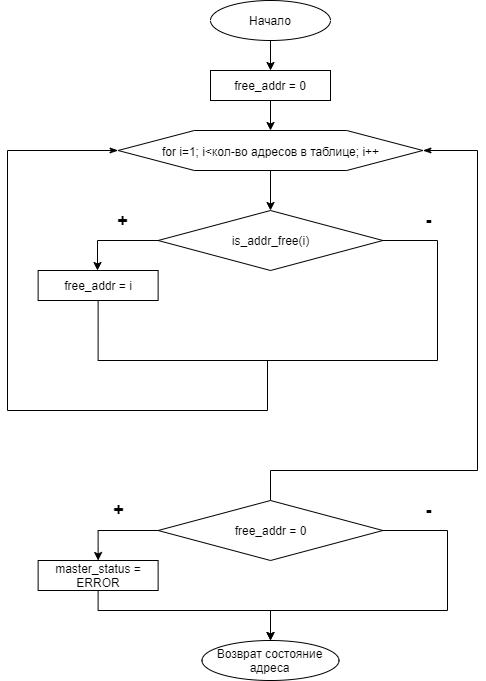

# Введение

В данной выпускной квалификационной работе описано создание межпротокольного шлюза
MQTT - CAN, в рамках программно-аппаратного комплекса умный дом.

@latex \clearpage @/latex

# Основная часть

## Описание предметной области, анализ и выбор методов решения задач

### Описание и анализ предметной области

@todo нормально структурировать информацию и переписать  раздел "Описание и анализ предметной области"

Программно-аппаратный комплекс - набор аппаратных и программных средств, работающих для выполнения одной или нескольких связанных задач.

Аппаратная часть комплекса представляет собой: компьютеры и микроконтроллеры объединенные в одну вычислительную сеть, посредством гетерогенных сетей, а так же различные датчики и исполнительные устройства.

Программной частью комплекса являются встроенное программное обеспечение, реализующее функционал исполнительных устройств и датчиков,  сетевое взаимодействие, различные программные модули сетевых протоколов.

Система домашней автоматизации решает ряд задач таких как:

* сбор и обработка данных полученных с датчиков системы, а так же с внешних источников.
* регулирование внутренних параметров системы, в зависимости от обработанных данных и предпочтений пользователей.
* обеспечение безопасности дома (пожарная безопасность, предупреждение аварийных ситуаций).
* упрощение однотипных процессов пользователей при помощи программируемых сценариев.
* экономия ресурсов домовладения, при помощи эффективного их использования.
* предоставление различных отчетов, по использованным ресурсам домовладения.

Саму система может включать в себя различные подсистемы разделенные по функциональным возможностям:

* подсистема управления освещением
  * элементы управления освещением
  * модули управления естественным освещением (шторы, рольставни, электрохромные стекла)
  * датчики присутствия, освещения
  * контроллеры сцен освещения (RGB контроллеры)
* подсистема управления климатом
  * внутренние и внешние метеорологические датчики (термометр, барометр, гигрометр, датчик уровня $CO_2$ и чистоты воздуха)
  * модули управления климатом
  * термостаты, рекуператоры, гигростаты, приточная и вытяжная вентиляция (с электрическим управлением)
* подсистема безопасности
  * подсистема видеонаблюдения
  * модули детектирования утечек природного газа, утечек воды
  * умные замки
  * модули сигнализации и сирены
* управляющая подсистема

В данные момент на рынке систем домашних автоматизаций преобладают 2 типа реализаций: готовые экосистемы от крупных производителей и открытые реализации систем поддерживаемые и разрабатываемые сообществами энтузиастов.

Среди готовых продуктов зарубежных производителей можно отметить Xiaomi Smart Home, Philips Hue, Samsung SmartThings и другие. Отечественные компании так же предлагают к покупке экосистемные продукты такие как "Умный дом Sber" и "Умный дом (Rostelecom)".

Достоинства таких готовых систем заключаются в простоте настройки и расширения системы, гарантированной тех. поддержки от производителя. Зачастую инфраструктура таких систем находится в облачных вычислительных мощностях, что позволяет использовать домашние устройства из любой точки мира. Из этого следует один из основных недостатков готовых систем домашней автоматизации - привязка к инфраструктуре производителя. При отсутствии подключения к ней, устройства могут терять функционал, вплоть до полного отключения, в случае отсутствия автономных режимов работы. Так же у готовых систем есть проблемы с расширяемостью и совместимостью. Линейка устройств производимая одной компанией может не включать в себя необходимые пользователю устройства, и не иметь возможности расширить систему компонентами сторонних производителей. Использование ПО с закрытым исходным кодом или лицензиями, а так же отсутствие документации, затрудняет разработку компонентов для сторонних производителей или интеграцию компонентов таких систем в другие. 

Открытые реализации систем домашней автоматизации, предлагают использование открытых протоколов обмена информации между компонентами системы, для согласования различных протоколов используются специальные агрегирующие сервисы, 

### Выбор методов решения задачи

@todo (предлагаем гетерогенные приколы)

@todo (рассказываем про CAN)

@todo (рассказываем про MQTT)

@todo (рассказываем про Bluetooth LE Mesh)

@todo (рассказываем про все вместе)

@todo (схема концепции умного дома)

## Проектирование аппаратного обеспечения

### Разработка принципиальной схемы

@todo (нарисовать схему шлюза и рассказать про ее модули)

### Разработка печатной платы

@todo (нарисовать плату и рассказать про нее)

## Проектирование программного обеспечения

### Разработка методов решения задач

@todo (схема модели OSI но с CAN)

### Разработка структур данных

@todo CAN_ID, DHCP_CAN_IP: структуры данных

**Адресная таблица, используемая для управления адресами на CAN шине**

Для хранения информации о выданных адресах мастер на CAN шине (в данном случае шлюз), создает у себя в памяти таблицу соответствия адреса устройства на CAN шине и уникального аппаратного идентификатора.

Таблица представляет из себя массив размером до 255 элементов, каждый элемент содержит структуру запись таблицы. 
Она состоит из 2 полей: 

* can_addr - 1 байтовое беззнаковое число, содержащее адрес устройства на шине.
* hwid - массив из 4-х 4 байтовых чисел, содержащее уникальный аппаратный идентификатор.

### Разработка и описание алгоритмов

**Алгоритмы работы с адресная таблицей**

## Программная реализация

### Описание модульной структуры программы

### Спецификации подпрограмм (методов)

@todo Адресная таблица: спецификации

### Описание использованных внешних компонент и библиотек

**Библиотека для работы с переферией микроконтроллера STM32CUBE**

**Реализация семейства функции printf без зависимостей от stdlib.h**

Для генерации символьных сообщений протокола MQTT удобно использовать функцию *sprintf*, из семейства функций *print formatted*, позволяющая выводить строки содержащие значения различных типов. В случае функции sprintf, она позволяет выводить в отформатированную функцию в переменную строки а не потоки ввода-вывода, в отличии от других функций семейства. Но функции входящие в стандартную библиотеку языка Си, не подходят для использования в встраиваемых система из-за ряда особенностей.

Во первых стандартная реализация функций *printf* имеет ряд зависимостей из стандартной библиотеки языка Си, которые после компиляции занимают значительный объем в флеш памяти микроконтроллера (около 32 Кб). 

Во вторых стандартная реализация *printf* использует динамическое выделение памяти, что не рекомендовано стандартами и руководствами разработки программно-аппаратных комплексом высокой надежности и ответственности (IEC 61508, MISRA C).

Для решения этой проблемы была использована сторонняя реализация функций семейства printf (ссылка на репозиторий) для языка Си, разработанная специально для использования в встраиваемых системах.

Данная реализация имеет совместимость с реализацией из стандартной библиотеки, но занимает значительно меньший объем в флеш памяти микроконтроллера (14 Кб против 32 Кб).

Так же реализация не использует динамическое выделение памяти для работы функций, что соответствует мировым стандартам разработки встраиваемых систем, а так же исправляет некоторые особенности стандартной реализации функций семейств *printf*, связанных с потоко-безопасностью.

Библиотека с сторонней реализацией распространяется с открытой лицензией MIT, что позволяет использовать данную реализацию в любых коммерческих и не коммерческих разработках.

### Руководство пользователя

### Тестирование и экспериментальная проверка программного-аппаратного комплекса

### Оценка качества разработанного комплекса

@latex \clearpage @/latex

# Заключение

@latex \clearpage

\begin{thebibliography}{3}

\end{thebibliography}

@/latex